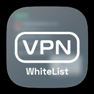
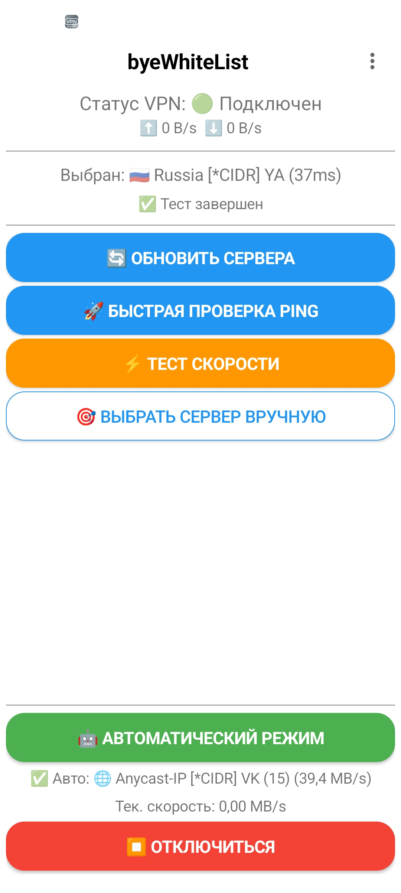
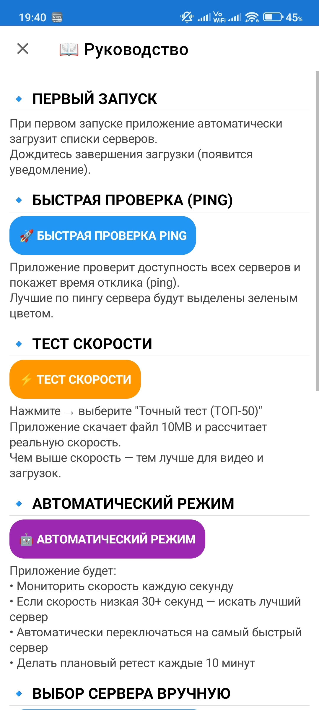
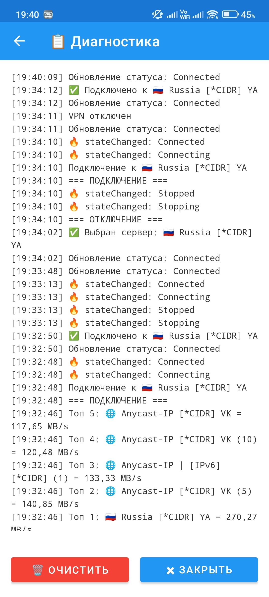
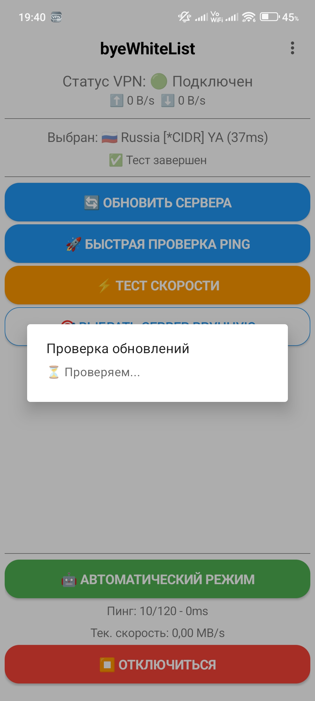

<h1 align="center">
    
     
    byeWhiteList
</h1>

    <strong>⚡ Автоматический выбор самого быстрого VPN-сервера для Android 🇷🇺</strong>

    
    
    
    
    

<!-- ТЕГИ ДЛЯ ПОИСКА -->
<!-- 
vpn
vpn-client
android-vpn
auto-vpn
speed-test
vpn-russia
byewhitelist
nekobox
sing-box
обход блокировок
российский впн
-->

---

## 📌 Что это?

**byeWhiteList** — умный VPN-клиент для Android, который сам находит самый быстрый сервер в России. Забудьте о ручном выборе: приложение тестирует скорость всех доступных серверов и автоматически переключает вас на лучший.

## 📱 Скриншоты

    
    
    
    

## 🔥 Возможности

| Функция | Описание |
|---------|----------|
| **🚀 Тест скорости** | Пинг и реальная скорость (скачивание 10MB) для всех серверов |
| **🤖 Авторежим** | Фоновый мониторинг и автоматическое переключение при падении скорости |
| **⚡ Российские CDN** | Тесты через Tele2, Selectel, Hostkey — точный результат даже без Cloudflare |
| **🎯 Умный выбор** | Список серверов с сортировкой по скорости и цветовой индикацией |
| **📊 Мониторинг** | Скорость текущего соединения на главном экране |
| **🔄 Актуальные списки** | Подписки обновляются по нажатию кнопки |
| **🔔 Проверка обновлений** | Автоматическое уведомление о новых версиях |

## 📥 Установка

1. Скачайте последний APK из **[Releases](https://github.com/Zhuk001/vpn_whitelist/releases)**
2. Откройте файл на устройстве и разрешите установку
3. Готово! 🎉

## 🎮 Как пользоваться

| Шаг | Действие |
|-----|----------|
| 1 | При первом запуске списки серверов загрузятся автоматически |
| 2 | Нажмите **🚀 Быстрая проверка Ping** — узнайте, какие серверы доступны |
| 3 | Нажмите **⚡ Тест скорости** → выберите "Точный тест (ТОП-50)" |
| 4 | Включите **🤖 Автоматический режим** — приложение само переключит на лучший |
| 5 | Или нажмите **🎯 Выбрать сервер вручную** для ручного выбора |

## 🛠️ Технологии

- **Язык:** Kotlin
- **Ядро:** [NekoBox](https://github.com/MatsuriDayo/NekoBoxForAndroid) / sing-box
- **Сеть:** OkHttp
- **База данных:** Room
- **Минимальная версия:** Android 5.0 (API 21)

## 🙏 Благодарности

- **[NekoBox for Android](https://github.com/MatsuriDayo/NekoBoxForAndroid)** — мощное ядро, на котором построено приложение
- **[igareck](https://github.com/igareck)** — актуальные списки VPN-конфигураций ([vpn-configs-for-russia](https://github.com/igareck/vpn-configs-for-russia))

## 📄 Лицензия

MIT — подробнее в [LICENSE](LICENSE)

## 📞 Контакты

- **GitHub Issues:** [создать обращение](https://github.com/Zhuk001/vpn_whitelist/issues)
- **Email:** [kluchshifrovaniya@proton.me](mailto:kluchshifrovaniya@proton.me)

---

    <b>⭐ Если проект полезен — поставьте звезду! Это помогает развитию.</b>

